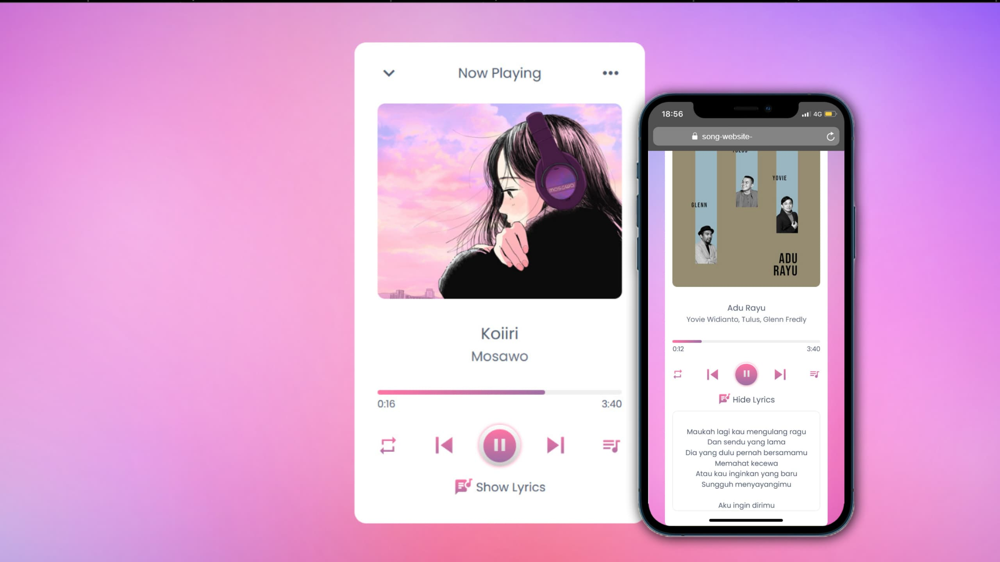

<p align="center">
  
</p>

# Song Website for Someone 

Hi everyone, this is a small project of mine, I made a `song website for someone`, there are not too many features on the website.

The Tech Stack that I use here is 3, namely: </br>

  

## Website Features

The following are the features displayed on the `Song Website`:

- 🎯 Songs can be played, paused, resumed, replayed, and can select the song you want to play
- 🎯 Displays song lyrics

### Short code from index.html and lyrics.js files:
<details close="close">
<summary><i><b>File index.html</b></i></summary>

***
```html
/**
  * ©RizkyWahyudi
  **/
<!DOCTYPE html>
<html lang="en">
  <head>
    <meta charset="UTF-8" />
    <meta name="viewport" content="width=device-width, initial-scale=1.0" />
    <title>Music Website | Anonymous</title>
    <link rel="stylesheet" href="style.css" />
    <link
      rel="stylesheet"
      href="https://fonts.googleapis.com/icon?family=Material+Icons"
    />
  </head>
  <body>
    <div class="header finisher-header"></div>
    <div class="wrapper">
      <div class="top-bar">
        <i class="material-icons">expand_more</i>
        <span>Now Playing</span>
        <i class="material-icons">more_horiz</i>
      </div>
      <div class="img-area">
        
      </div>
      <div class="song-details">
        <p class="name"></p>
        <p class="artist"></p>
      </div>
      <div class="progress-area">
        <div class="progress-bar">
          <span></span>
        </div>
        <div class="timer">
          <span class="current">0:20</span>
          <span class="duration">3:40</span>
        </div>
        <audio id="main-audio" src=""></audio>
      </div>
      <div class="controls">
        <i id="repeat-list" class="material-icons" title="Playlist looped"
          >repeat</i
        >
        <i id="prev" class="material-icons">skip_previous</i>
        <div class="play-pause">
          <i class="material-icons">play_arrow</i>
        </div>
        <i id="next" class="material-icons">skip_next</i>
        <i id="more-music" class="material-icons">queue_music</i>
      </div>
      <!-- Lyrics Section -->
      <div class="lyrics-toggle">
        <i id="lyrics-btn" class="material-icons">lyrics</i>
        <span>Show Lyrics</span>
      </div>
      <div class="lyrics-area">
        <div class="lyrics-content"></div>
      </div>
      <!-- End Lyrics Section -->
      <div class="music-list">
        <div class="header">
          <div class="row">
            <i class="material-icons">queue_music</i>
            <span>Music list</span>
          </div>
          <i id="close" class="material-icons">close</i>
        </div>
        <ul></ul>
      </div>
    </div>

    <script src="js/music-list.js"></script>
    <script src="js/script.js"></script>
    <script src="js/lirik.js"></script>

    <script src="js/finisher-header.es5.min.js" type="text/javascript"></script>
    <script type="text/javascript">
      new FinisherHeader({
        count: 23,
        size: {
          min: 1030,
          max: 1500,
          pulse: 0,
        },
        speed: {
          x: {
            min: 0.6,
            max: 3,
          },
          y: {
            min: 0.6,
            max: 3,
          },
        },
        colors: {
          background: "#953eff",
          particles: ["#ff681c", "#87ddfe", "#231efe", "#ff0a53"],
        },
        blending: "lighten",
        opacity: {
          center: 0.6,
          edge: 0,
        },
        skew: 0,
        shapes: ["c"],
      });
    </script>
  </body>
</html>

```
***
</details></details>
<details close="close"><summary><i><b>File lirik.js</b></i></summary>

***
```js
/**
  * ©RizkyWahyudi
  **/
l// Contoh objek dengan lirik lagu
const lyricsData = [
  {
    src: "beliCiki-Koiiri", // pastikan cocok dengan src di music-list.js
    lyrics: `
    Beli Ciki
    Beli koyo
    
    Sukiyo
    Ima anata ni omoi nosete hora
    Sunao ni naru no watashi
    Kono saki motto
    Sobani ite moikana
    Koi to koi ga kasanate
    
    Sukiyo..`,
  },
  {
    src: "reff-aduRayu",
    lyrics: `
    Maukah lagi kau mengulang ragu
    Dan sendu yang lama
    Dia yang dulu pernah bersamamu
    Memahat kecewa
    Atau kau inginkan yang baru
    Sungguh menyayangimu
    
    Aku ingin dirimu
    Yang menjadi milikku
    Bersamaku mulai hari ini
    Hilang ruang untuk cinta yang lain`,
  },
  // Tambahkan lirik untuk lagu lainnya
];

```
***
</details></details>
<details close="close">
<summary><i><b>Send List Message</b></i></summary>

  ***
```js
/**
  * ©DitzDev
  **/
let sections = [{
  title: 'title',
  rows: [{
  header: 'header',
  title: 'title',
  description: 'description',
  id: 'id' 
}] 
}]

conn.sendListMsg(jid, 'text', 'footer', 'titleButton', sections, quoted)
```
***
</details></details>
<details close="close">
<summary><i><b>Send List Message With Image</b></i></summary>

***
```js
/**
  * ©DitzDev
  * The imageUrl part must be a string of url
  **/
let sections = [{
  title: 'title',
  rows: [{
  header: 'header',
  title: 'title',
  description: 'description',
  id: 'id' 
}] 
}]

conn.sendListImg(jid, 'text', 'footer', 'titleButton', sections, imageUrl, quoted)
```
***
</details></details>
<details close="close">
<summary><i><b>Send Button Card</b></i></summary>

***
```js
/**
  * ©DitzDev
  * The imageUrl part must be a string of url
  * [cards] Must follow the example below
  * type = ['buttons', 'url']
  **/
  let cards = [
    {
      header: 'header',
      body: 'body',
      footer: 'footer',
      imageUrl: 'string',
      buttons: [
        {
          type: 'url',
          text: "text of buttons url",
          url: "https://example.com"
        },
        {
          type: 'buttons',
          text: "text of buttons",
          id: "quick_reply_id_1"
        }
      ]
    }
  ];

  await conn.sendButtonCard(jid, 'text', 'footer', cards, quoted);
```
***
</details></details>

## Hosting Wsbite

I host my website with `vercel` </br>


> [!NOTE]
>
> I made this website because he is my friend, not my partner, I also made this as practice for myself
